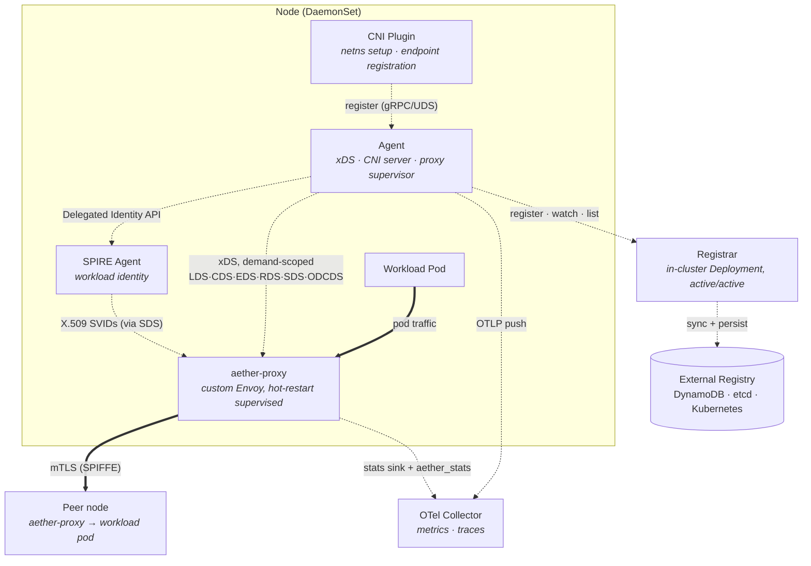

# Aether

A Kubernetes service mesh data plane built in Go. Aether runs a per-node agent (DaemonSet) that drives a custom Envoy build (`aether-proxy`) via an xDS control plane, plus a CNI plugin that sets up pod network namespaces and registers their endpoints. Config is **demand-scoped**: each agent generates only the clusters, registry watches, and endpoints its local pods actually depend on (declared via the `aether.io/upstreams` annotation), with on-demand CDS for the cold path. An in-cluster Registrar service proxies all registry operations, caches a versioned endpoint snapshot, and streams changes to agents. It integrates with SPIRE for workload identity and mTLS, supports zero-drop proxy rollouts via Envoy hot restart, and exports OpenTelemetry metrics and traces. Pluggable external registry backends: DynamoDB, etcd, and Kubernetes.

## Architecture

Solid arrows are the workload **data path**; dashed arrows are **control plane / telemetry**.



**Agent** — Runs on each node via `controller-runtime`. Manages the xDS server, CNI gRPC server, SPIRE bridge, registrar client, and the proxy hot-restart supervisor as runnables. Generates Envoy configuration (listeners, clusters, endpoints, routes) from local pod data and the endpoint cache populated by the Registrar's push stream. Config is **demand-scoped** to each node's dependency set (see below).

**aether-proxy** — A custom Envoy build maintained in a separate sibling Bazel workspace under `proxy/` (pinned to its own Bazel 7.7.1, built from Envoy source) with a compiled-in C++ `aether_stats` extension that records source→destination request metrics. The agent supervises it with cross-pod hot restart for hitless rollouts and two-phase connection draining. See [`proxy/README.md`](proxy/README.md) and proposals [010](docs/proposals/010_custom-proxy-workspace.md) / [012](docs/proposals/012_aether_stats_cpp_extension.md).

**Demand-scoped distribution** — Each agent generates only the clusters, registry watches, and endpoints its local pods declare a dependency on via the `aether.io/upstreams` annotation, with on-demand CDS (ODCDS) serving the cold path. This bounds per-node config to the node's actual footprint and replaces fleet-wide CDS and client-side active health checking. Multi-port and FQDN upstreams are demuxed via SNI with per-port EDS. See proposals [004](docs/proposals/004_demand-scoped-distribution.md) / [005](docs/proposals/005_multi-port-routing.md).

**Registrar** — In-cluster Deployment that acts as the sole bridge between agents and the external registry. Receives endpoint registrations from agents, persists them externally, maintains a versioned in-memory snapshot via periodic sync, and streams changes to all agents via gRPC server-streaming. Runs as an active/active Deployment (every replica serves gRPC and syncs; peers converge through the external registry), collapsing per-node external connections down to the registrar tier.

**CNI Plugin** — Implements the CNI spec (Add/Del/Check/GC/Status) to set up each pod's network namespace. Communicates with the agent over a Unix domain socket to register the pod's endpoints on Add and deregister them on Del.

**SPIRE Bridge** — Connects to the SPIRE agent via the Delegated Identity API to obtain X.509 SVIDs and trust bundles. Converts them into Envoy SDS (Secret Discovery Service) resources for automatic mTLS between workloads.

**External Registry** — Pluggable backend for durable endpoint storage, selected on the Registrar via `--registry-backend`:
- **DynamoDB** — single-table design for AWS-native deployments
- **etcd** — hierarchical key structure with protobuf serialization, native Watch for change streaming
- **Kubernetes** — registry backed by the cluster API

**Observability** — Push-first OpenTelemetry. When `telemetry.otlpEndpoint` is set, the agent, CNI, and registrar export OTLP metrics (`--otel-enabled`) and optionally traces (`--tracing-enabled`) to a collector. The proxy ships its Envoy stats over the same sink, and the compiled-in `aether_stats` extension emits per-source/destination request counters.

## Getting Started

### Prerequisites

- [Bazelisk](https://github.com/bazelbuild/bazelisk) (Bazel 9.0.1)
- Go 1.26.2
- Docker (or Colima) for container images and integration tests

### Setup (macOS with Colima)

If you use Colima for Docker on macOS, run this once to configure the Docker socket for Bazel sandboxed tests:

```bash
./bazel/configure_colima.sh
```

This generates `.bazelrc.colima` (gitignored) with your socket path. The config is auto-enabled on macOS via `--config=colima`.

### Build

```bash
make build-agent           # Build the node agent
make build-registrar       # Build the registrar service
make build-cni-install     # Build the CNI installer
```

### Test

```bash
make test                  # Run all tests (requires Docker for integration tests)
make test-unit             # Run unit tests only (no Docker required)
make test-integration      # Run integration tests only (requires Docker)
make test-race             # Run all tests with Go race detector
```

### Code Quality

```bash
make format                # Format all code (Go, protobuf, Starlark, shell)
make format-check          # Check formatting (CI-friendly, fails on drift)
make lint                  # Run linters (buf, buildifier, shellcheck)
```

Formatting uses [gofumpt](https://github.com/mvdan/gofumpt), [buildifier](https://github.com/bazelbuild/buildtools), [shfmt](https://github.com/mvdan/sh), and [buf](https://buf.build) via [`aspect_rules_lint`](https://github.com/aspect-build/rules_lint). Linting runs buf (protobuf), buildifier (Starlark), and shellcheck (shell) as Bazel aspects. CI enforces lint violations with `--config=ci`.

### Container Images

```bash
make load-all              # Load all images into local Docker
make push-all              # Push all images to registry
```

### Adding Go Dependencies

```bash
bazel run @rules_go//go get <package>
bazel run //:gazelle
```
