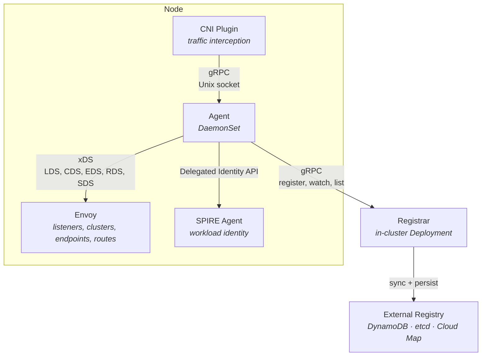

# Aether

A Kubernetes service mesh data plane built in Go. Aether runs a per-node agent (DaemonSet) that manages an Envoy xDS control plane and a CNI plugin for transparent traffic interception. An in-cluster Registrar service proxies all registry operations, caches an endpoint snapshot, and streams changes to agents. It supports pluggable external registry backends (DynamoDB, etcd, AWS Cloud Map) and integrates with SPIRE for workload identity and mTLS.

## Architecture



**Agent** — Runs on each node via `controller-runtime`. Manages the xDS server, CNI gRPC server, SPIRE bridge, and registrar client as runnables. Generates Envoy configuration (listeners, clusters, endpoints, routes) from local pod data and the endpoint cache populated by the Registrar's push stream.

**Registrar** — In-cluster Deployment that acts as the sole bridge between agents and the external registry. Receives endpoint registrations from agents, persists them externally, maintains a versioned in-memory snapshot via periodic sync, and streams changes to all agents via gRPC server-streaming. Reduces external connections from N (one per node) to 1 per cluster.

**CNI Plugin** — Implements the CNI spec (Add/Del/Check/GC/Status) for transparent traffic interception. Communicates with the agent over a Unix domain socket for pod registration.

**SPIRE Bridge** — Connects to the SPIRE agent via the Delegated Identity API to obtain X.509 SVIDs and trust bundles. Converts them into Envoy SDS (Secret Discovery Service) resources for automatic mTLS between workloads.

**External Registry** — Pluggable backend for durable endpoint storage, selected on the Registrar via `--registry-backend`:
- **DynamoDB** — single-table design for AWS-native deployments
- **etcd** — hierarchical key structure with protobuf serialization
- **AWS Cloud Map** — multi-cluster service discovery via AWS Cloud Map

## Getting Started

### Prerequisites

- [Bazelisk](https://github.com/bazelbuild/bazelisk) (Bazel 9.0.1)
- Go 1.26.0
- Docker (or Colima) for container images and integration tests

### Setup (macOS with Colima)

If you use Colima for Docker on macOS, run this once to configure the Docker socket for Bazel sandboxed tests:

```bash
./bazel/configure_colima.sh
```

This generates `.bazelrc.colima` (gitignored) with your socket path. The config is auto-enabled on macOS via `--config=colima`.

### Build

```bash
make build-agent           # Build the node agent
make build-registrar       # Build the registrar service
make build-cni-install     # Build the CNI installer
```

### Test

```bash
make test                  # Run all tests (requires Docker for integration tests)
make test-unit             # Run unit tests only (no Docker required)
make test-integration      # Run integration tests only (requires Docker)
make test-race             # Run all tests with Go race detector
```

### Code Quality

```bash
make fmt                   # Format Go code with gofmt
make fmt-check             # Check formatting (CI-friendly, fails on drift)
make vet                   # Run go vet
```

### Container Images

```bash
make load-all              # Load all images into local Docker
make push-all              # Push all images to registry
```

### Adding Go Dependencies

```bash
bazel run @rules_go//go get <package>
bazel run //:gazelle
```
