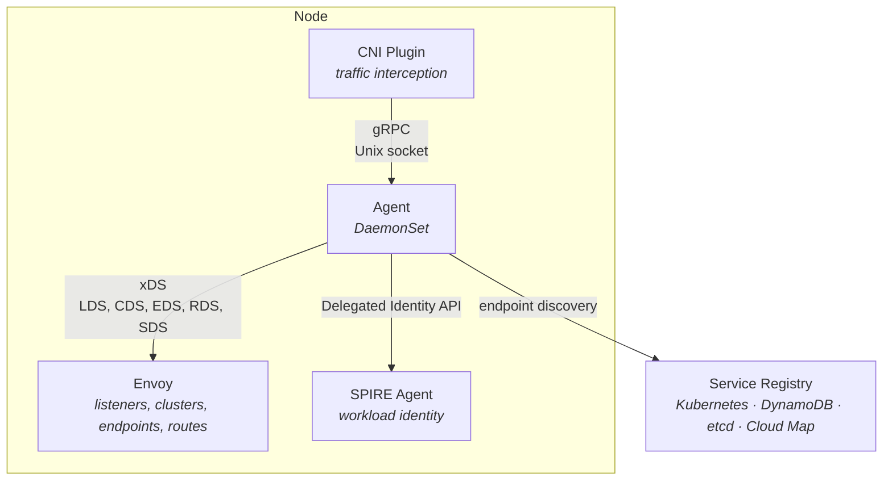

# Aether

A Kubernetes service mesh data plane built in Go. Aether runs a per-node agent (DaemonSet) that manages an Envoy xDS control plane and a CNI plugin for transparent traffic interception. It supports pluggable service registries (Kubernetes, DynamoDB, etcd, AWS Cloud Map) for endpoint discovery and integrates with SPIRE for workload identity and mTLS.

## Architecture



**Agent** — Runs on each node via `controller-runtime`. Manages the xDS server, CNI gRPC server, SPIRE bridge, and registry connection as runnables. Generates Envoy configuration (listeners, clusters, endpoints, routes) from local pod data and the service registry.

**CNI Plugin** — Implements the CNI spec (Add/Del/Check/GC/Status) for transparent traffic interception. Communicates with the agent over a Unix domain socket for pod registration.

**SPIRE Bridge** — Connects to the SPIRE agent via the Delegated Identity API to obtain X.509 SVIDs and trust bundles. Converts them into Envoy SDS (Secret Discovery Service) resources for automatic mTLS between workloads.

**Service Registry** — Pluggable backend for endpoint discovery, selected at runtime via `--registry-backend`:
- **Kubernetes** (default) — discovers endpoints directly from the Kubernetes API server
- **DynamoDB** — single-table design for AWS-native deployments
- **etcd** — hierarchical key structure with protobuf serialization
- **AWS Cloud Map** — multi-cluster service discovery via AWS Cloud Map

## Getting Started

### Prerequisites

- [Bazelisk](https://github.com/bazelbuild/bazelisk) (Bazel 9.0.1)
- Go 1.26.0
- Docker (or Colima) for container images and integration tests

### Build

```bash
make build-agent           # Build the node agent
make build-cni-install     # Build the CNI installer
```

### Test

```bash
make test                  # Run all tests (requires Docker for integration tests)

# Unit tests only
bazel test --test_output=errors --test_tag_filters=-integration //...

# Integration tests (testcontainers)
bazel test --test_output=errors //registry/internal/ddb:ddb_test
bazel test --test_output=errors //registry/internal/etcd:etcd_test
```

### Container Images

```bash
make load-all              # Load all images into local Docker
make push-all              # Push all images to registry
```

### Adding Go Dependencies

```bash
bazel run @rules_go//go get <package>
bazel run //:gazelle
```
