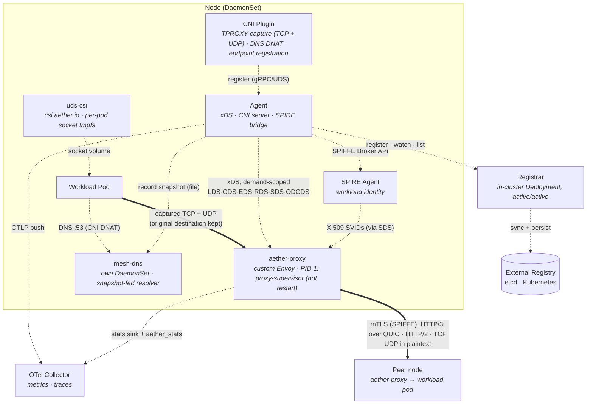

# Aether

A Kubernetes service mesh data plane built in Go. The Go module is `aethermesh.dev` (a vanity import path served by [the website](https://aethermesh.dev/); versions before the rename remain importable as `github.com/bpalermo/aether` — see proposal 035). Aether runs a per-node agent (DaemonSet) that drives a custom Envoy build (`aether-proxy`) via an xDS control plane, plus a chained CNI plugin that registers each pod's endpoints and **transparently captures** its outbound TCP and UDP with a TPROXY-style mark-and-divert, so the original destination survives. Between proxies every HTTP hop is mTLS with the workload's own SPIFFE identity, over **HTTP/3 (QUIC)** by default and HTTP/2 where QUIC does not apply. Config is **demand-scoped**: each agent generates only the clusters, registry watches, and endpoints its local pods actually depend on (declared via the `config.aether.io/upstreams` annotation), with on-demand CDS for the cold path. An in-cluster Registrar service proxies all registry operations, caches a versioned endpoint snapshot, and streams changes to agents. Routing is driven by the **Gateway API** (GAMMA east-west, `HTTPRoute`/`GRPCRoute`/`TCPRoute`/`TLSRoute`/`UDPRoute`, plus an optional north-south edge gateway). It integrates with SPIRE for workload identity and mTLS, supports zero-drop proxy rollouts via Envoy hot restart, and exports OpenTelemetry metrics and traces. Pluggable external registry backends: etcd and Kubernetes.

## Architecture

Solid arrows are the workload **data path**; dashed arrows are **control plane / telemetry**.


```mermaid
graph TD
    subgraph node["Node (DaemonSet)"]
        Pod["Workload Pod"]
        CNI["CNI Plugin<br/><i>TPROXY capture (TCP + UDP) · DNS DNAT · endpoint registration</i>"]
        Agent["Agent<br/><i>xDS · CNI server · SPIRE bridge</i>"]
        Proxy["aether-proxy<br/><i>custom Envoy · PID 1: proxy-supervisor (hot restart)</i>"]
        MeshDNS["mesh-dns<br/><i>own DaemonSet · snapshot-fed resolver</i>"]
        SPIRE["SPIRE Agent<br/><i>workload identity</i>"]
        UdsCsi["uds-csi<br/><i>csi.aether.io · per-pod socket tmpfs</i>"]

        Pod == "captured TCP + UDP<br/>(original destination kept)" ==> Proxy
        Pod -. "DNS :53 (CNI DNAT)" .-> MeshDNS
        Agent -. "record snapshot (file)" .-> MeshDNS
        CNI -. "register (gRPC/UDS)" .-> Agent
        UdsCsi -. "socket volume" .-> Pod
        Agent -. "xDS, demand-scoped<br/>LDS·CDS·EDS·RDS·SDS·ODCDS" .-> Proxy
        Agent -. "SPIFFE Broker API" .-> SPIRE
        SPIRE -. "X.509 SVIDs (via SDS)" .-> Proxy
    end

    Peer["Peer node<br/><i>aether-proxy → workload pod</i>"]
    Proxy == "mTLS (SPIFFE): HTTP/3 over QUIC · HTTP/2 · TCP<br/>UDP in plaintext" ==> Peer

    Registrar["Registrar<br/><i>in-cluster Deployment, active/active</i>"]
    Agent -. "register · watch · list" .-> Registrar

    Registry[("External Registry<br/>etcd · Kubernetes")]
    Registrar -. "sync + persist" .-> Registry

    OTel["OTel Collector<br/><i>metrics · traces</i>"]
    Agent -. "OTLP push" .-> OTel
    Proxy -. "stats sink + aether_stats" .-> OTel
```

**Agent** — Runs on each node via `controller-runtime`. Manages the xDS server, CNI gRPC server, SPIRE bridge, and registrar client as runnables. Generates Envoy configuration (listeners, clusters, endpoints, routes) from local pod data and the endpoint cache populated by the Registrar's push stream. Config is **demand-scoped** to each node's dependency set (see below). One agent owns a node at a time: the owner holds an exclusive lock, and with `agent.updateStrategy.surge=true` (default off) a rolled agent's successor starts beside it as a standby, builds its whole first snapshot, and binds the node sockets only when the lock is released (proposal [041](docs/proposals/041_agent-surge-handoff.md)).

**aether-proxy** — A custom Envoy build maintained in a separate sibling Bazel workspace under `proxy/` (pinned to its own Bazel 8.7.0, built from Envoy source) with a compiled-in C++ `aether_stats` extension that records source→destination request metrics. It runs under the **proxy supervisor** — its own binary and image (`agent/cmd/proxy-supervisor`) since #772 and PID 1 of the `aether-proxy` container, not part of the agent — which performs cross-pod hot restart for hitless rollouts and two-phase connection draining (proposal [001](docs/proposals/001_proxy-hot-restart.md)). See [`proxy/README.md`](proxy/README.md) and proposals [010](docs/proposals/010_custom-proxy-workspace.md) / [012](docs/proposals/012_aether_stats_cpp_extension.md).

**Demand-scoped distribution** — Each agent generates only the clusters, registry watches, and endpoints its local pods declare a dependency on via the `config.aether.io/upstreams` annotation, with on-demand CDS (ODCDS) serving the cold path. This bounds per-node config to the node's actual footprint and replaces fleet-wide CDS and client-side active health checking. Multi-port and FQDN upstreams are demuxed via SNI with per-port EDS. See proposals [004](docs/proposals/004_demand-scoped-distribution.md) / [005](docs/proposals/005_multi-port-routing.md).

**Transparent capture** — On by default for managed pods. The CNI plugin programs a TPROXY-style mark-and-divert in each pod's network namespace for **both TCP and UDP**: the IP header is left intact, so the proxy sees the original destination (there is no `REDIRECT` and no mode flag). Captured TCP lands on the per-pod capture listener (`18001`), captured UDP on a per-VIP `udp_proxy` listener (`18082`). Managed pods are **redirect-all** by default (`agent.captureRedirectAllDefault=true`): a dial to a mesh service's own port is captured too, for TCP; UDP is captured on `18082` only. Pod DNS is the one plain DNAT, `:53` to the node's mesh-dns. See proposals [022](docs/proposals/022_arbitrary-service-interception.md) / [038](docs/proposals/038_udp-tproxy-capture.md).

**Transport between proxies** — Every mesh pod has an inbound on `18008`, TCP and UDP/QUIC on the same number, with the same SVID and the same client-certificate requirement on both. HTTP requests ride **HTTP/3 over QUIC** with no value or flag to enable it: the first request from a (source ServiceAccount, destination) pair makes the proxy fetch a per-source `quic:` cluster on demand, so the caller's own identity is what the destination sees. Two cases stay on HTTP/2 by design: a GAMMA rule with a weighted split, and a service with an endpoint behind the east/west waypoint. Raw TCP rides the mesh as an mTLS passthrough. **UDP rides in plaintext**: mTLS is a TCP/TLS construct and DTLS is not implemented. East-west QUIC needs two DNS SANs on every workload SVID and UDP `18008` open wherever TCP `18008` is; see [Getting started](docs/getting-started.md#east-west-quic) and proposal [038](docs/proposals/038_udp-tproxy-capture.md).

**Retries** — A caller's proxy retries on a different endpoint (2 retries) on what the destination's proxy reports in the `x-aether-outcome` response header, not on the status code alone. A request that was never delivered to the application is retried whatever its method, and so is an application's own `503` or a refused HTTP/2 stream. A request the application had received and did not answer is replayed only for idempotent methods (`GET`, `HEAD`, `OPTIONS`, `TRACE`, `PUT`, `DELETE`): a `POST` gets the `503`. An undelivered gRPC call is retried; a gRPC status the application returned is not. See [What the mesh retries for you](docs/workload-requirements.md#what-the-mesh-retries-for-you).

**mesh-dns** — A slim per-node DaemonSet (its own binary and image) that answers `<svc>.<ns>.<meshDomain>` from a record snapshot the agent writes to a host path, and forwards everything else upstream. The CNI DNATs each managed pod's `:53` to it. It is deliberately decoupled from the agent (#578, #583) so an agent roll never gaps pod DNS.

**Gateway API & GAMMA routing** — Routing is expressed with the Kubernetes **Gateway API**. East-west (mesh) traffic uses **GAMMA**: `HTTPRoute`/`GRPCRoute` objects with a `parentRef` to a **Service** enrich that service's outbound/capture routes (canary splits, header/method matches, timeouts, redirects). `TCPRoute`, `TLSRoute` (SNI passthrough) and `UDPRoute` parented to a Service do the same for L4, each gated only on its Gateway API CRD being installed. North-south traffic uses the same API against the edge gateway's `GatewayClass`. Both directions share one projector, **`common/gammaproject`**, which turns a route rule into a `registryv1.GammaRoute` proto; the node agent materializes it locally into Envoy config while the registrar can export it cross-cluster. An **`HTTPFilter`** CRD (proposal 025) is the escape hatch for attaching supported Envoy HTTP filters (ext_authz, RBAC, header-to-metadata) at route, service-wide (`CHAIN`), or destination-side (`INBOUND`) scope; `ext_authz` pairs with an optional node-local authorization sidecar with an OPA preset (`proxy.authzSidecar.enabled`, default off; proposal [027](docs/proposals/027_ext-authz.md)).

**Edge gateway** — Optional (`edge.enabled`, default off). An unprivileged Deployment in its own namespace running Envoy beside the `agent edge` control plane; it dials mesh pods directly over mTLS with its own SVID and serves the routes attached to `Gateway`s of its `GatewayClass`. Tuning is the `EdgeConfig` CRD, attached with `parametersRef` (proposal [029](docs/proposals/029_edge-config.md)): hardening defaults, and downstream **HTTP/3** on the HTTPS port (`edge.config.http3.enabled`, default off). GeoIP request headers are opt-in (proposal [028](docs/proposals/028_geoip.md)).

**Multi-cluster** — Layered and opt-in, on the etcd backend: endpoints through MCS `ServiceExport`/`ServiceImport`, exported GAMMA routes through the registrar's config export and the agent's `--import-config` (proposal [026](docs/proposals/026_multi-cluster-config-propagation.md)), and a per-node east/west waypoint on `18009` where pod IPs are not routable across clusters (proposal [019](docs/proposals/019_multicluster-node-waypoint.md)).

**Controller** — In-cluster Deployment (leader-elected) that serves the admission webhooks (`MeshConfig`, `HTTPFilter`, `EdgeConfig`, `EndpointPolicy`, `HTTPRoute` validation + a pod-mutating webhook for mesh-domain `ndots`, namespace-based mesh injection, and the `aether-identity-ready` init container that holds a mesh pod's app containers until SPIRE has issued its SVID, #1055) and projects each namespace's `MeshConfig` CR into a ConfigMap the agent and edge mount.

**Registrar** — In-cluster Deployment that acts as the sole bridge between agents and the external registry. Receives endpoint registrations from agents, persists them externally, maintains a versioned in-memory snapshot via periodic sync, and streams changes to all agents via gRPC server-streaming. Runs as an active/active Deployment (every replica serves gRPC and syncs; peers converge through the external registry), collapsing per-node external connections down to the registrar tier.

**CNI Plugin** — Implements the CNI spec (Add/Del/Check/GC/Status) as a plugin chained after the cluster's primary CNI. On Add it programs the capture divert and the DNS DNAT in the pod's network namespace and registers the pod's endpoints with the agent over a Unix domain socket; on Del it deregisters them. It exports no telemetry of its own: it forwards its timings to the agent.

**UDS delivery** — Workloads that serve on a Unix domain socket instead of a TCP port join the mesh with `endpoint.aether.io/uds-socket: <volume>/<file>` (or a service-scoped `EndpointPolicy` CR). The socket lives in an inline `csi: {driver: csi.aether.io}` volume — a per-pod tmpfs the mesh's own CSI node plugin mounts (`nosymfollow,nodev,nosuid,noexec`) — and the proxy dials it there; callers are unaffected — the pod is still reached at its pod IP over mTLS. See proposals [034](docs/proposals/034_pod-uds-support.md) and [039](docs/proposals/039_uds-csi-driver.md).

**SPIRE Bridge** — Connects to the SPIRE agent's [SPIFFE Broker Endpoint](https://github.com/spiffe/spiffe/blob/main/standards/SPIFFE_Broker_Endpoint.md) (mTLS over a Unix socket) and brokers an X.509-SVID for every pod on the node by **Kubernetes object reference** — SPIRE resolves and attests the pod itself, so any selector its attestor can produce is usable in the registration entry. Trust bundles come from the agent's own Workload API identity plus the federated bundles those streams carry. Everything is converted into Envoy SDS (Secret Discovery Service) resources for automatic mTLS between workloads. Requires **SPIRE >= 1.15.2** with its experimental broker enabled (proposal 036; replaced SPIRE's proprietary Delegated Identity API).

**External Registry** — Pluggable backend for durable endpoint storage, selected on the Registrar via `--registry-backend`:
- **etcd** — hierarchical key structure with protobuf serialization, native Watch for change streaming
- **Kubernetes** — registry backed by the cluster API

**Observability** — Push-first OpenTelemetry. When `otel.endpoint` is set (chart value; `--otlp-endpoint` on each binary), the agent, registrar and controller export OTLP metrics (`--otel-enabled`) and optionally traces (`--trace-export`) to a collector; the CNI plugin takes no endpoint and the agent exports its timings. The proxy ships its Envoy stats over the same sink, and the compiled-in `aether_stats` extension emits per-source/destination request counters. A separate chart, `prober`, runs a per-node synthetic prober that measures availability from the client side (proposal [013](docs/proposals/013_mesh-availability-prober.md)).

**Data-plane ports** — `18001` per-pod TCP capture (the divert target); `18008` mesh inbound, TCP and UDP/QUIC; `18009` east/west waypoint tunnel; `18021` edge readiness; `18054` the node's mesh-DNS resolver; `18081` per-pod outbound HTTP; `18082` the L4 port, TCP and UDP.

## Getting Started

### Prerequisites

- [Bazelisk](https://github.com/bazelbuild/bazelisk) (Bazel 9.2.0)
- Go 1.27.1
- Docker (or Colima) for container images and integration tests

### Setup (macOS with Colima)

If you use Colima for Docker on macOS, run this once to configure the Docker socket for Bazel sandboxed tests:

```bash
./bazel/configure_colima.sh
```

This generates `.bazelrc.colima` (gitignored) with your socket path. The config is auto-enabled on macOS via `--config=colima`.

### Build

```bash
make build-agent           # Build the node agent
make build-registrar       # Build the registrar service
make build-cni-install     # Build the CNI installer
```

### Test

```bash
make test                  # Run all tests (requires Docker for integration tests)
make test-unit             # Run unit tests only (no Docker required)
make test-integration      # Run integration tests only (requires Docker)
make test-race             # Run all tests with Go race detector
```

### Code Quality

```bash
make format                # Format all code (Go, protobuf, Starlark, shell)
make format-check          # Check formatting + buildifier lint (CI-friendly, fails on drift)
make lint                  # Run linters (buf, shellcheck, gocognit)
```

Formatting uses [gofumpt](https://github.com/mvdan/gofumpt), [buildifier](https://github.com/bazelbuild/buildtools), [shfmt](https://github.com/mvdan/sh), and [buf](https://buf.build) via [`aspect_rules_lint`](https://github.com/aspect-build/rules_lint). Linting runs buf (protobuf), shellcheck (shell) and gocognit (Go) as Bazel aspects; buildifier's Starlark linter runs inside `make format-check`. CI enforces lint violations with `--config=ci`.

### Container Images

```bash
make load-all              # Load the five Make-built images (agent, mesh-dns, proxy-supervisor,
                           # cni-install, registrar) into local Docker
make push-all              # Push those five to the registry (bazel/registry/registry.bzl); for
                           # local/dev use — releases are published by the signed publish workflow
```

### Published artifacts

Every image and chart is published by CI to the `aethermesh` organisation on
[quay.io](https://quay.io/organization/aethermesh) (proposal 040): images as
`quay.io/aethermesh/<component>` (`agent`, `mesh-dns`, `proxy-supervisor`,
`cni-install`, `registrar`, `controller`, `prober`, `udsecho`, `proxy`), charts as
`oci://quay.io/aethermesh/chart-<name>` (`crds`, `aether`, `prober`, `udsecho`),
each signed keyless with cosign (the signature is an OCI 1.1 referrer) and
carrying SLSA build provenance as a GitHub artifact attestation; see
[Verifying a release](docs/verifying-releases.md):

```bash
helm upgrade --install aether-crds oci://quay.io/aethermesh/chart-crds --version <X.Y.Z>-<full git sha>
# First install only: the namespace, labelled for Pod Security admission.
kubectl create namespace aether-system
kubectl label namespace aether-system \
  pod-security.kubernetes.io/enforce=privileged \
  pod-security.kubernetes.io/audit=privileged \
  pod-security.kubernetes.io/warn=privileged
helm upgrade --install aether oci://quay.io/aethermesh/chart-aether --version <X.Y.Z>-<full git sha> \
  -n aether-system --create-namespace
```

The chart does not create the `aether-system` namespace (Helm or you do), and
nothing labels it for you: on a cluster that enforces Pod Security admission the
agent's pods need the three labels above. See
[Getting started](docs/getting-started.md#install).

The charts moved from ghcr.io at **1.0.0** — a major bump, because the default
image repositories changed; see [Getting started](docs/getting-started.md) for the
upgrade. Releases published before the move went to ghcr.io; nothing publishes to
or verifies against ghcr.io any more (proposal 040 phase 4).

### Adding Go Dependencies

```bash
bazel run @rules_go//go get <package>
bazel run //:gazelle
```

## License

Licensed under the [Apache License, Version 2.0](./LICENSE). See [NOTICE](./NOTICE)
for attribution.
