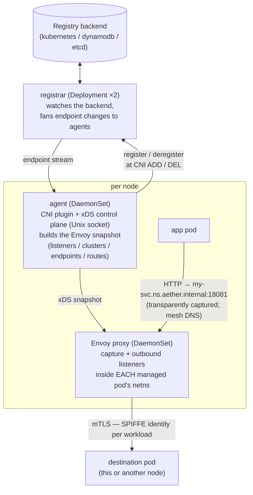

# Getting Started with Aether

A practical guide to installing Aether and onboarding your first workload.

> **What is Aether?** Aether is a Kubernetes service-mesh **data plane** written
> in Go. A per-node **agent** (DaemonSet) runs an Envoy xDS control plane and a
> chained CNI plugin; a per-node **Envoy proxy** (DaemonSet) carries the traffic;
> an in-cluster **registrar** tracks service endpoints; and a **controller**
> serves the admission webhooks. Every pod-to-pod hop is mTLS with SPIFFE
> identities — including same-node hops. Interception is **transparent by
> default**: managed pods' outbound traffic is redirected into the mesh by the
> CNI, mesh names resolve via a per-node mesh DNS, and apps simply dial
> `http://<svc>.<ns>.<meshDomain>` (or the ordinary Kubernetes Service name).
> An explicit local outbound listener (`127.0.0.1:18081` + `Host` header)
> remains available for clients that prefer zero interception assumptions.

---

## Table of contents

1. [How it works (the 2-minute model)](#how-it-works)
2. [Prerequisites](#prerequisites)
3. [Install](#install)
4. [Configure](#configure)
5. [Which pods are managed (and which are never)](#managed-pods)
6. [Onboard a workload](#onboard-a-workload)
7. [Call other services](#call-other-services)
8. [Roll without dropping requests](#hitless-rolls)
9. [Advanced routing (pinning, subsets, locality)](#advanced-routing)
10. [Shape traffic with Gateway API (GAMMA)](#gamma)
11. [North-south ingress (the edge gateway)](#edge)
12. [Multi-cluster and multi-region](#multi-cluster)
13. [Observability](#observability)
14. [Troubleshooting](#troubleshooting)

---

<a name="how-it-works"></a>
## 1. How it works (the 2-minute model)



- **Identity = ServiceAccount, scoped by namespace.** A pod's mesh service is
  its **ServiceAccount name in its namespace** (`<ns>/<sa>`); its SPIFFE ID is
  `spiffe://<trust-domain>/ns/<namespace>/sa/<serviceaccount>`. Pods sharing a
  ServiceAccount (in one namespace) are endpoints of the same service.
- **Transparent addressing (default).** The CNI redirects managed pods'
  outbound TCP into the per-pod capture listener and DNATs `:53` to a per-node
  mesh DNS. Apps dial `http://<svc>.<ns>.<meshDomain>:18081` — or the
  generated Kubernetes Service name `<svc>.<ns>.svc.cluster.local:18081` —
  with no client changes. The explicit listener (`127.0.0.1:18081` +
  `Host: <svc>.<ns>.<meshDomain>`) still works everywhere.
- **Demand-scoped.** Each node only receives the config for the services its
  local pods actually call (declared up front, or fetched on first use).

---

<a name="prerequisites"></a>
## 2. Prerequisites

| Requirement | Why | Notes |
|---|---|---|
| **Kubernetes cluster** | host | v1.30+ recommended (native `preStop.sleep` is used for hitless rolls). |
| **A primary CNI** (Calico, Cilium, flannel, …) | pod IP + connectivity | Aether installs a **chained** CNI plugin (`aether.conflist`) that appends itself to your existing CNI config. It does *not* replace your CNI. |
| **SPIRE** (SPIFFE runtime) | mTLS identity | Required when `spire.enabled=true` (the default). The agent, registrar and controller consume the **Workload API socket** (via the `csi.spiffe.io` CSI driver), and the agent additionally uses the SPIRE **agent admin / Delegated Identity** socket to mint proxy SVIDs. SPIRE pods must run in an ignored namespace (see §5) so they never depend on the mesh. |
| **A registry backend** | endpoint storage | One of `kubernetes` (default, no external dependency), `dynamodb` (AWS), or `etcd`. |
| **Helm 3** with OCI support | install | Charts are published as OCI artifacts. |
| **Privileged pod-security** in `aether-system` | the agent needs `hostNetwork` + `NET_ADMIN` | The chart labels its namespace `privileged` automatically when it creates it. |

> You can run **without mTLS** for a quick kick-the-tires install by setting
> `spire.enabled=false`, which skips the SPIRE dependency entirely. Don't do that
> in production — it disables workload mTLS.

---

<a name="install"></a>
## 3. Install

Aether ships **two** charts. Install the CRDs first (they are standalone so they
can be upgraded independently), then the system chart.

```bash
# Pick the published version (chart version == git commit of the release).
VERSION=0.x.0-<commit>

# 1) CRDs (MeshConfig, HTTPFilter, EdgeConfig) — install/upgrade first.
helm upgrade --install aether-crds \
  oci://ghcr.io/bpalermo/aether/charts/crds \
  --version "$VERSION"

# 2) The system: agent + proxy + registrar + controller.
helm upgrade --install aether \
  oci://ghcr.io/bpalermo/aether/charts/aether \
  --version "$VERSION" \
  --namespace aether-system --create-namespace \
  --set clusterName=my-cluster \
  --set meshDomain=aether.internal
```

Resource names derive from the **release** name — installing as `aether` yields
`aether-agent`, `aether-proxy`, `aether-registrar`, `aether-controller`.

> **Upgrade tip:** always pass the **full** values on every `helm upgrade` of the
> `aether` chart — do **not** use `--reuse-values` (it keeps the stale
> digest-pinned image). Bump the chart version per change.

Verify:

```bash
kubectl -n aether-system get pods         # agent + proxy per node, registrar ×2, controller
kubectl -n aether-system get meshconfig   # the seeded "default" MeshConfig CR
```

---

<a name="configure"></a>
## 4. Configure

Configuration splits into two layers:

### 4a. Deploy-time system config (chart values)

Set once at the top of the `aether` chart's values; every component inherits it.

| Value | Default | What it does |
|---|---|---|
| `clusterName` | `talos-main` | Cluster name in registry keys (registrars are per-cluster; names need not be unique across clusters). |
| `meshDomain` | `aether.internal` | The authority suffix services are addressed under (`<svc>.<ns>.<meshDomain>`). Also defaults the SPIRE trust domain. |
| `spire.enabled` | `true` | Mesh-wide mTLS switch. |
| `spire.trustDomain` | `""` (→ `ROOTCA` sentinel) | SPIFFE trust domain authorized for the registrar's mTLS peers. |
| `spire.workloadSocketPath` | `/run/secrets/workload-spiffe-uds/socket` | Workload API socket. |
| `spire.adminSocket.*` | see values | SPIRE agent admin/Delegated-Identity socket the agent uses to mint proxy SVIDs. |
| `registrar.registryBackend` | `kubernetes` | `kubernetes` \| `dynamodb` \| `etcd`. |
| `registrar.etcd.endpoints` | `[]` | etcd endpoints when backend is `etcd`. |
| `registrar.aws.region` / `agent.awsCredentials` | — | DynamoDB backend config. |
| `otel.enabled` / `otel.endpoint` | `false` / `""` | Turn on OTel and point at an OTLP gRPC collector (`host:port`). |
| `proxy.enabled` | `true` | Deploy the per-node Envoy. Set false to run only the agent. |
| `edge.enabled` | `false` | Deploy the north-south ingress gateway (see §11). |

### 4b. Runtime proxy observability (the `MeshConfig` CR)

`MeshConfig` is **namespaced**: the controller seeds one named `default` in the
control-plane namespace on first install and never overwrites it on upgrade —
you own it via `kubectl` thereafter. Every workload namespace inherits it
field-by-field unless it defines its own `MeshConfig` (at most one per
namespace). It **only** overrides the proxy data plane's observability (access
logs, tracing, per-pod stats); everything else stays inherited from the system
config.

```bash
kubectl -n aether-system edit meshconfig default   # mesh-wide baseline
kubectl -n my-namespace apply -f my-meshconfig.yaml  # per-namespace override
```

```yaml
apiVersion: config.aether.io/v1
kind: MeshConfig
spec:
  proxy:
    accessLogsEnabled: true
    accessLogSuccessSampleRate: 100   # % of successful requests logged
    tracingEnabled: true
    traceSampleRate: 0.01             # head sampling, 0.0–1.0
    emitStatsPod: false
```

Changes are projected into a ConfigMap the agent mounts and applied to the data
plane without a redeploy.

---

<a name="managed-pods"></a>
## 5. Which pods are managed (and which are never)

### Opt **in** with a label

A pod joins the mesh **only** if it carries:

```yaml
metadata:
  labels:
    aether.io/managed: "true"
```

The CNI plugin programs the outbound listener (and mTLS identity) into a pod's
network namespace at CNI ADD time *only* for labelled pods. A pod also needs at
least one IP. Everything else on the node is left untouched.

### Always-ignored namespaces

These namespaces are **never** intercepted, regardless of labels — the control
plane and the mesh's own dependencies must never rely on the mesh to start up
(otherwise the mesh and SPIRE deadlock each other):

```
kube-system
aether-system
spire-mgmt
spire-server
spire-system
```

(Matching is case-insensitive.) So a `aether.io/managed: "true"` pod in
`kube-system` is still ignored.

### Opt **out**

To exclude a specific pod, simply omit the `aether.io/managed` label (or set it to
anything other than `"true"`). There is no force-include for ignored namespaces.

---

<a name="onboard-a-workload"></a>
## 6. Onboard a workload

A minimal mesh-managed Deployment:

```yaml
apiVersion: apps/v1
kind: Deployment
metadata:
  name: my-svc
spec:
  replicas: 4
  minReadySeconds: 10                         # see §8
  strategy:
    rollingUpdate: { maxSurge: 1, maxUnavailable: 0 }
  template:
    metadata:
      labels:
        app: my-svc
        aether.io/managed: "true"             # ← opt into the mesh
    spec:
      serviceAccountName: my-svc              # ← SERVICE NAME = ServiceAccount
      containers:
        - name: app
          readinessProbe:                     # gates endpoint promotion
            httpGet: { path: /healthz, port: 8080 }
          lifecycle:
            preStop: { sleep: { seconds: 10 } }   # see §8
```

Your service is now addressable mesh-wide as `my-svc.<namespace>.aether.internal`
(and via the generated `my-svc.<namespace>.svc.cluster.local` Service).

### Optional endpoint annotations

| Annotation | Default | Meaning |
|---|---|---|
| `endpoint.aether.io/port` | `8080` | Application port the mesh routes to. |
| `endpoint.aether.io/weight` | `1024` | Load-balancing weight. |
| `endpoint.aether.io/health-path` | `/` | Path the node-local agent health-checks (delegated liveness). |
| `endpoint.aether.io/health-check-mode` | `eds` | `eds` = agent vets the endpoint and publishes health over EDS (clients get pre-warmed endpoints); `active` = every client proxy probes the endpoint itself. |
| `metadata.endpoint.aether.io/<key>` | — | Free-form endpoint metadata, usable as routing subsets (§9). |
| `config.aether.io/upstreams` | — | Comma-separated services this pod **calls** (§7). |

---

<a name="call-other-services"></a>
## 7. Call other services

With transparent capture + mesh DNS (both on by default), just dial the
destination by name — no client changes, no special listener:

```bash
# from inside a managed pod — either form works
curl http://svc-payments.payments.aether.internal:18081/orders
curl http://svc-payments.payments.svc.cluster.local:18081/orders
```

- **Mesh FQDNs are namespace-qualified:** `<service>.<namespace>.<meshDomain>`
  (proposal 020). The registrar also generates a selectorless Kubernetes
  Service per mesh service, so the ordinary
  `<service>.<namespace>.svc.cluster.local` name is captured too. Port `18081`
  is the mesh port those generated Services expose.
- With **redirect-all** (the default, proposal 022) *all* outbound TCP from a
  managed pod is captured: mesh destinations are routed by the mesh, and
  anything else (external APIs, non-mesh Services) passes through untouched.
  Carve-outs are per-pod annotations (`capture.aether.io/*`, see the
  configuration reference).
- The callee sees the caller's SPIFFE ID in `x-forwarded-client-cert` (XFCC).

### The explicit listener (still supported)

Clients that prefer zero interception assumptions can keep addressing the
local outbound listener directly:

```bash
curl http://127.0.0.1:18081/orders -H 'Host: svc-payments.payments.aether.internal'
```

Authorities are FQDN-only and deterministic: bare names, foreign domains, or
nested labels match no route and **404 immediately**. A `:port` suffix is
stripped before routing.

### Declare your upstreams (recommended)

The mesh only distributes a service's config to nodes that need it. Declare what a
pod calls so those clusters are **warm before first use**:

```yaml
metadata:
  annotations:
    config.aether.io/upstreams: "svc-payments,svc-ledger,svc-audit"
```

- **Declared** upstreams are present the moment the pod lands — declare anything
  latency- or correctness-critical.
- **Undeclared** upstreams still work via the cold path (ODCDS): the first request
  pauses ~one node-local xDS round-trip while the cluster is fetched on demand,
  then stays warm (1h idle TTL). Each miss increments
  `aether.agent.upstreams.miss` — the signal to promote it to the annotation.
- A pod's **own** service is always in scope; never declare it.

### Use keep-alive / HTTP-2 connections

The mesh pools upstream mTLS connections **per downstream connection** (so one
pod's certificate is never reused for another pod's traffic). A long-lived client
connection — HTTP/1.1 keep-alive or an HTTP/2/gRPC channel — reuses its mTLS
connection across requests. Connection-per-request clients pay a fresh handshake
every time: it works, but it's the expensive shape.

---

<a name="hitless-rolls"></a>
## 8. Roll without dropping requests

The mesh does most of the work (endpoints go DRAINING the instant deletion is
*requested*, new endpoints arrive pre-vetted, connection-level failures retry on
another endpoint). Two workload settings close the rest — **without them, rolls
outrun the mesh and drop requests**:

1. **`minReadySeconds: 10`** — paces the roll so the old endpoint is retired only
   after the replacement is actually mesh-routable (~5–10s after Ready).
2. **`preStop: { sleep: { seconds: 10 } }`** — delays SIGTERM so in-flight
   requests finish through the two-phase drain. Measured: `sleep 10` → **0 failed
   requests/roll**; `sleep 3` (the supported minimum) → ~1 blip per pod.

Also keep **`maxUnavailable: 0`** and a real **`readinessProbe`** (endpoint
promotion gates on the app actually answering).

**Avoid `--grace-period=0` force deletes** for serving workloads — they skip the
draining phase, so brief errors are possible.

### What the mesh retries for you

On a **different endpoint** (2 attempts, 25–250 ms backoff): `connect-failure`,
`refused-stream`, `reset-before-request`, and `503`. These all fail before
reaching your app, so retries are safe even for non-idempotent traffic.
Application 5xx and timeouts are deliberately **not** retried.

---

<a name="advanced-routing"></a>
## 9. Advanced routing (pinning, subsets, locality)

### Pin to one endpoint

| Header | Meaning |
|---|---|
| `x-aether-ip: 10.42.1.11` | route to exactly that endpoint IP |
| `x-aether-pod: my-svc-7f9c4-xv2qp` | route to exactly that pod |

Pin-or-fail: if the target is gone, you get a 503 — never a silent fallback.

### Provider-defined subsets

Endpoints publish routing dimensions; consumers select them:

```yaml
# on the endpoint (producer)
metadata:
  annotations:
    metadata.endpoint.aether.io/version: "v2"
```

```bash
# on the request (consumer)
curl http://127.0.0.1:18081/ -H 'Host: my-svc.aether.internal' \
     -H 'x-aether-subset-version: v2'
```

Selection is strict (no fallback): asking for a subset with no endpoints **fails**
rather than spilling onto the rest of the service. Up to 4 subset keys intersect
(`...-version: v2` + `...-shard: s1` → endpoints matching both). Keys
`ip`/`pod`/`cluster`/`namespace` are reserved.

### Locality-aware failover

Endpoints carry their node's `topology.kubernetes.io/region` and `zone`. Each
node's proxy prefers same-zone endpoints (priority 0), spilling to same-region (1)
then anywhere (2) only as closer endpoints drain or fail. Nodes without topology
labels express no preference.

---

<a name="gamma"></a>
## 10. Shape traffic with Gateway API (GAMMA)

East-west traffic management uses the **standard Gateway API route types
parented to a Service** (the GAMMA pattern) — no custom routing CRDs. Enable
it with `agent.gamma=true` (requires the Gateway API CRDs); L4 route types are
on by default (`agent.l4Routes`).

```yaml
apiVersion: gateway.networking.k8s.io/v1
kind: HTTPRoute
metadata:
  name: my-svc-canary
  namespace: payments
spec:
  parentRefs:
    - kind: Service            # ← GAMMA: parented to the SERVICE, not a Gateway
      name: my-svc
  rules:
    - backendRefs:
        - { kind: Service, name: my-svc,    port: 8080, weight: 90 }
        - { kind: Service, name: my-svc-v2, port: 8080, weight: 10 }
```

What's supported, all applied **transparently on the capture path** as well as
the explicit listener (so callers need no changes):

- **`HTTPRoute`** — weighted canary, header/path matching + mutation,
  redirects, timeouts, mirroring; Mesh conformance profile (MESH-HTTP Core)
  green.
- **`GRPCRoute`** — method-based routing (`<svc>/<method>` matched as a path).
- **`TCPRoute`** — weighted L4 splits across backends; an explicit `weight: 0`
  drains a backend.
- **`TLSRoute`** — SNI-based passthrough routing.
- (`UDPRoute` is accepted but control-plane-only for now.)
- **Cross-namespace backends** need a standard `ReferenceGrant`.
- The parent must be a **registry-backed mesh Service** (one with live
  endpoints) — a selectorless "anchor" Service won't survive reconciliation.

For behavior the route types can't express, the **`HTTPFilter` CRD** (proposal
025) attaches a vetted set of raw Envoy HTTP filters — `ext_authz` (pairs with
the node-local authz sidecar + OPA preset, proposal 027), `RBAC` (peer-SAN
allow/deny), `header-to-metadata` — per route (Gateway API `ExtensionRef`),
per Service (`targetRefs`), service-wide (`SCOPE_CHAIN`), or on the
destination's inbound (`SCOPE_INBOUND`). Validation is fail-closed via the
controller webhook.

---

<a name="edge"></a>
## 11. North-south ingress (the edge gateway)

The optional **edge** is an unprivileged Deployment (its own `aether-ingress`
namespace by default) running Envoy + an `agent edge` sidecar. It dials mesh pods
**directly** over mTLS (the node DaemonSet is not in its path) and routes external
traffic via the **Gateway API** (proposal 018): the edge serves the `HTTPRoute`s
attached to `Gateway`s of its `GatewayClass` (`gateway.aether.io/edge`
controller). The retired `EdgeRoute` / `VirtualHost` CRDs are gone — Gateway API
is the edge's only routing API. Requires the standard Gateway API CRDs installed
in the cluster.

Enable it:

```bash
helm upgrade --install aether oci://ghcr.io/bpalermo/aether/charts/aether \
  --version "$VERSION" -n aether-system \
  --set edge.enabled=true
  # ... plus your other values
```

The chart renders the `GatewayClass` and — by default (`edge.gateway.create=true`)
— a `Gateway` of that class. Expose a service by attaching an `HTTPRoute` to it
(the chart can manage routes declaratively via `edge.gateway.httpRoutes`, or apply
your own):

```yaml
apiVersion: gateway.networking.k8s.io/v1
kind: HTTPRoute
metadata:
  name: api
  namespace: aether-ingress          # the namespace the edge watches
spec:
  parentRefs:
    - name: aether-edge              # the chart-managed Gateway
  hostnames: ["api.example.com"]     # external Host/SNI
  rules:
    - backendRefs:
        - name: svc-1                # the mesh service to route to
          port: 8080
```

- The edge routes **only** by explicit external hostname on the attached routes.
  The internal mesh FQDN (`<svc>.<meshDomain>`) is deliberately **not** routable
  from the edge.
- **TLS:** set `edge.tls.enabled=true` and reference a `kubernetes.io/tls` Secret
  per Gateway listener (`spec.listeners[].tls.certificateRefs`, or the chart's
  `edge.gateway.tlsSecretName`). The edge agent serves the cert to Envoy over SDS
  (SNI-selected, hot rotation, no pod roll) and 301-redirects HTTP→HTTPS. Aether
  does **not** issue certs — bring your own (cert-manager, `kubectl`, …).
- **Addressing:** per-Gateway addressing is on by default
  (`edge.perGatewayAddressing=true`, proposal 021) — each `Gateway` gets its own
  LoadBalancer Service and external IP; pin one with `edge.gateway.address`.
- **GeoIP:** set `edge.geoip.enabled=true` with a MaxMind mmdb Secret to emit
  `x-geo-*` request headers (proposal 028).
- The edge gets its own SVID straight from SPIRE; with `spire.enabled` the chart
  can create its `ClusterSPIFFEID` (`edge.spire.clusterSpiffeID`).

---

<a name="multi-cluster"></a>
## 12. Multi-cluster and multi-region

Multi-cluster is layered: each plane is independent and opt-in, and they
compose into full cross-cluster routing. All of it requires the **etcd**
registry backend (the cross-cluster plane) and, for any cross-cluster data
path, **one SPIFFE trust domain shared across clusters** (e.g. SPIRE with a
shared upstream CA) so identities verify across the cluster line.

| Plane | What it does | Enable |
|---|---|---|
| **Endpoints (MCS)** | `ServiceExport` publishes a service to the clusterset; every cluster materializes a `ServiceImport` + clusterset VIP and sees the remote endpoints. | `registrar.enableMCS=true` (+ the MCS-API CRDs) |
| **Config (026)** | Exported services' GAMMA routes (`HTTPRoute`/`GRPCRoute`, incl. `HTTPFilter` chain scope) propagate to peer clusters and merge into their proxies (local config wins). | exporter: `registrar.enableMCS=true`; importer: `agent.importConfig=true`. Optionally pin one authoritative exporter with `controlCluster=<name>` |
| **Data path (019)** | When pod IPs aren't routable across clusters (the usual case), cross-cluster endpoints are dialed at their **node's** routable IP on the east/west tunnel port (`18009`); the destination node's proxy SNI-forwards to the local pod. mTLS stays end-to-end pod↔pod. Intra-cluster traffic is unaffected. | `agent.eastWestWaypoint=true` on all clusters (tunnel port must match clusterset-wide) |
| **Multi-region (006)** | One etcd per region (`registrar.region`); each region's registrar mirrors its own registry subtree into peer regions' etcds under an **origin-heartbeat lease** — a dead region's mirror expires everywhere at the lease TTL (~30s), and locality keeps foreign endpoints on the failover path (EDS priority 2). | `registrar.region=<region>` + `registrar.peerEtcd=["<peer>=<endpoints>"]` per direction |

Minimal two-cluster recipe (shared regional etcd, cross-cluster service
`echo` living only in cluster `b`, called from cluster `a`):

```bash
# both clusters: etcd backend + waypoint + a shared trust domain
--set registrar.registryBackend=etcd \
--set "registrar.etcd.endpoints[0]=http://<shared-etcd>:2379" \
--set registrar.enableMCS=true \
--set agent.eastWestWaypoint=true \
--set clusterName=<unique-per-cluster>
```

Then `kubectl apply` a `ServiceExport` for `echo` in cluster `b`; a client in
`a` calls `http://echo.<ns>.<meshDomain>:18081/` and the request rides
mesh DNS → capture → split-horizon EDS → b's node tunnel → the echo pod,
mTLS end-to-end. (The reusable e2e harnesses under `e2e/` —
`multicluster_config.sh`, `multicluster_waypoint.sh`,
`multicluster_replicator.sh` — stand up exactly these topologies with kind.)

---

<a name="observability"></a>
## 13. Observability

Turn on OTel once at the system level:

```yaml
otel:
  enabled: true
  endpoint: "otel-collector.observability.svc:4317"   # OTLP gRPC
  logs: true            # component logs over OTLP (also tee'd to stderr)
  traceExport: true     # spans (needs a collector traces pipeline)
  traceSampleRate: 0.1
```

- The collector endpoint is **deploy-time** config baked into the CNI plugin and
  Envoy bootstrap (so the fleet rolls atomically and a config change can't break
  CNI) — it is not read from a runtime ConfigMap.
- Proxy access logs / tracing / per-pod stats are retunable at runtime via the
  `MeshConfig` CR (§4b) without a redeploy.
- Control-plane metrics, proxy stats, and a per-request source→destination request
  counter all flow over OTLP. Health-check traffic is excluded from access logs.

---

<a name="troubleshooting"></a>
## 14. Troubleshooting

| Symptom | Likely cause | Check |
|---|---|---|
| App can't reach the mesh (connection refused to `127.0.0.1:18081`) | Pod isn't managed, or the proxy hasn't programmed the listener yet | Confirm `aether.io/managed: "true"` and that the pod is **not** in an ignored namespace (§5); check the agent log for `adding listeners for pod`. |
| Request 404s immediately | Authority isn't a valid mesh FQDN | Use the namespace-qualified `<service>.<namespace>.<meshDomain>` (or the k8s Service name) — bare names and foreign domains 404 at the route table. |
| Request 503s on a pin | The pinned endpoint is gone (drained/ejected/never existed) | Pin-or-fail is by design; drop the `x-aether-ip`/`x-aether-pod` header to load-balance. |
| First call to a service is slow | Cold path (undeclared upstream) — one xDS round-trip | Declare it in `config.aether.io/upstreams`; watch `aether.agent.upstreams.miss`. |
| Dropped requests during a roll | Missing `minReadySeconds` / `preStop` / `maxUnavailable: 0` | Apply all three (§8); avoid `--grace-period=0`. |
| Mesh + SPIRE won't start | SPIRE running in a mesh-managed namespace | SPIRE must live in an ignored namespace (`spire-*`) so it doesn't depend on the mesh. |

### Useful commands

```bash
kubectl -n aether-system logs ds/aether-agent           # control plane + CNI
kubectl -n aether-system logs ds/aether-proxy           # the Envoy data plane
kubectl -n aether-system get meshconfig default -o yaml  # effective proxy observability
kubectl get httproutes -A                               # north-south + GAMMA routes
```

---

## See also

- [`docs/workload-requirements.md`](./workload-requirements.md) — the full
  workload contract (the authoritative source for §6–§9).
- [`charts/README.md`](../charts/README.md) — chart layout, image mirroring,
  versioning/stamping.
- `docs/proposals/` — design records: `003` (edge), `004` (demand-scoped),
  `018` (Gateway API/GAMMA/capture), `019` (east/west waypoint), `006`
  (multi-region replication), `025`–`027` (filters/authz),
  `013` (prober), `014` (access logs), `015` (MeshConfig).
